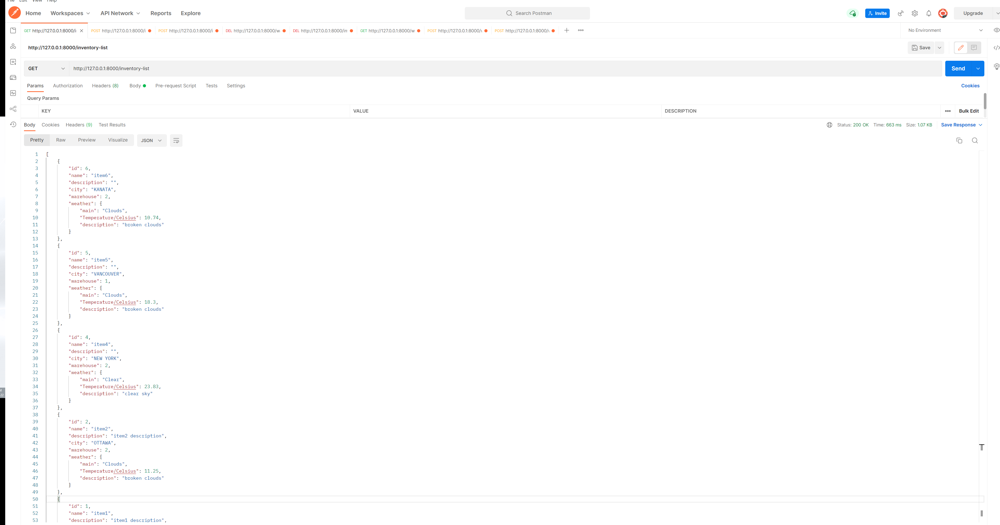
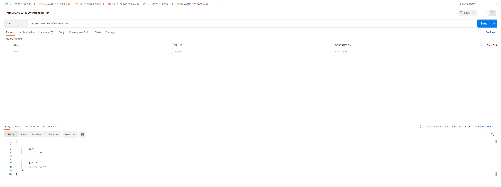

# Shopify-Backend-Internship-Challenge Fall 2022

Challenge description: [Fall 2022 - Shopify Developer Intern Challenge Question](https://docs.google.com/document/d/1PoxpoaJymXmFB3iCMhGL6js-ibht7GO_DkCF2elCySU/edit#heading=h.n7bww7g70ipk)

[Github](https://github.com/AaPaul/Shopify-Backend-Intership-Challenge)

[Replit publish address](https://replit.com/@bunabulapa/shopify-challenge?v=1)

[Public access address](https://shopify-challenge.bunabulapa.repl.co/) (Powered by Replit)

## Technologies
Python, Django, SQLite, Git


## Main features
- Basic **CRUD** functions for inventory items, including:
    - Create inventory items
    - Edit inventory items
    - Delete inventory items
    - View a list of inventory items
- Extract current weather information for each item by [OpenWeather](https://openweathermap.org/)
- Warehouses **CRUD** functions
- Assign the warehouse for each inventory item
- Response clear information after updating or deleting record
- Basic exception handler, including ObjectDoesNotExist Error and Restricted Error in the database model

Based on my understanding, I would like to create three tables in the database to implement all features, and their structrues show below. The first one is the table of Inventory and the other one is the table of Warehouse, where PK means primary key and FK means Foreign key. In Inventory table, we set the `Warehouse` attribute as a foreign key, **which is to satisfy the requirement that assign inventory to specific locations**. As we use the it can build a connection between Inventory and Warehouse. We don't have create a mapping table to store their connection. In this case, the value of this attributes in Inventory is limited which only depends on the value in Warehouse. The value which is not in the Warehouse would result in an Error.
Besides, I also creat City table which is the third table for future extending.

| ID | Name | Description | Warehouse | City |
| :----: | :----:  | :----:  | :----:  | :----:  |
| Integer (PK) | Char (Not Null) | Text | Integer (FK) | Integer (FK) |

| ID | Name | 
| :----: | :----:  |
| Integer (PK) | Char (Not Null) |

| ID | Name | 
| :----: | :----: |
| Integer (PK) | Char (Not Null) |

## Feature tests
Here I use Postman as my API test platform.

Before we starting the test, we need to check if you have the required database which should be included in the project. If not, we are supposed to add some initial data into the database. Otherwise, the list of all data would be null, althought there would be no error. I provide some data for initialization, as shown below.
- For Inventory
```
[
    {
        "id": 2,
        "name": "item2",
        "description": "item2 description",
        "city": 2,
        "warehouse": 2
    },
    {
        "id": 1,
        "name": "item1",
        "description": "item1 description",
        "city": 1,
        "warehouse": 1
    }
]
```
- For Warehouse
```
[
    {
        "id": 3,
        "name": "wh3",
    },
    {
        "id": 2,
        "name": "wh2",
    },
    {
        "id": 1,
        "name": "wh1",
    }
]
```

- For City
```
[
    {
        "id": 1,
        "name": "TORONTO"
    },
    {
        "id": 2,
        "name": "OTTAWA"
    },
    {
        "id": 3,
        "name": "KANATA"
    },
    {
        "id": 4,
        "name": "NEW YORK"
    },
    {
        "id": 5,
        "name": "VANCOUVER"
    },

]
```


### Inventory part
#### 1. View of a list of all items
The url for get all inventory items is `http://127.0.0.1:8000/inventory-list`.After sending a get request by Postman, we can get the result shows below.


#### 2. Adding a new inventory item
The url for adding new inventory item is `http://127.0.0.1:8000/inventory-create`. Firstly, we would like to change the request method to **POST**. Then, you are supposed to send data with JSON format. Choose `raw` and `JSON` as follows. Finally, send the request. The result shows below. You will get a response with the success message and the record you just created.


#### 3. Edit the inventory item
The url for editting the item is `http://127.0.0.1:8000/inventory-update/<str:pk>/`. We are supposed to replace `<str:pk>` with a specific integer which represents the ID of the item in the database. For example, here we are going to update the item with ID 3. Original data shows below.
```
{
    "id": 3,
    "name": "create-test",
    "description": "create test description",
    "city": 1,
    "warehouse": 1
}
```
We set POST method and choose `raw` and `JSON`. Then input the information we want to change. Here we change all attributes. After sending the request, it will give you the response with success message and updated record. **In this part, we also implement the function that we can assign the warehouse to the item (from warehouse 1 to warehouse 3)**.


If the item does not existed in the table, it will return the error message which points out that the required item is not in the table with status code 500 which means the internal error of the database.


#### 4. Delete the inventory item.
The url for deleting the item is `http://127.0.0.1:8000/inventory-delete/<str:pk>/`. It is similar to the updating part, we also need to replace the `<str:pk>` with an Integer. Here I just delete the item we created above. It will return the success message that shows you the item is deleted successfully.


### Warehouses part
It also includes the basic CRUD functionality. The difference is in the deleting part. Therefore, I would like to only introduce this part. Other test results would be shown as follows.
#### 1. Delete the warehouse
In this part, we are supposed to consider the connection between Warehouse and Inventory. Logically, we are not allowed to delete the warehouse instance which are playing the FK in the Inventory. Therefore, I add an extra error handler for this function.

- If no references on this instance, we can delete it successfully, like the result shows below.


- If this instance is referenced by inventory items, we cannot delete it. It will return the message with the Restriction error.


- If the required warehouse does not existed, we also cannot excute this process. It will return DoesNotExisted error.


#### 2. View of a list of all warehouse
The url for get all warehouses items is `http://127.0.0.1:8000/warehouse-list`.



#### 3. Create a warehouse
The url for creating is `http://127.0.0.1:8000/warehouse-create`.


#### 4. Update a warehouse
The url for updating is `http://127.0.0.1:8000/warehouse-update/<str:pk>/`.


## Local deployment
This project, as I mentioned above, is based on Python. Therefore, the first step of running it locally is to set up a Python environment.

Here I recommend [Anaconda](https://www.anaconda.com/) as the libraries management tool. After downloading the tool, we can create a virtual environment of this project.
```
conda create --name envname python=3.7
conda activate envname
```
Then we can install the libraries that we need in this project which are stored in the file named *requirments.txt*.
```
pip install -r requirments.txt
```
If there is no initial database in this project, before you run the project for the first time, you are supposed to do the migrations to initial the database.
If you are in the directory which includes *manage.py* , run the commands as follows.
```
python manage.py makemigrations
python manage.py migrate
```

Then you can start the server and do the next tests, which is supposed to show an overview page on `http://127.0.0.1:8000/` that introduces all APIs in this project with the default settings. If you can get the page shows below, that means you successfully run it.


We can also get the overview data with AIP test tools, like Postman.


